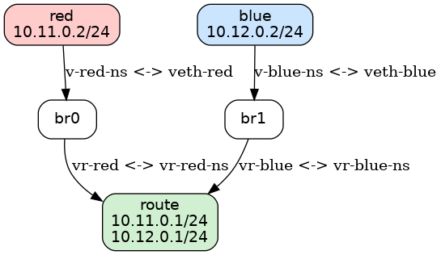

# 🖧 Linux Network Namespace Simulation

This project demonstrates how to simulate a virtual network environment using Linux network namespaces, virtual Ethernet (veth) pairs, and bridges. It models a basic network topology with two isolated network namespaces (`red` and `blue`) connected through a router namespace (`route`).

---

## 📊 Topology Overview

### Visual Diagram



### Text-Based Topology

[ red ] <---> [ br0 ] <---> [ route ] <---> [ br1 ] <---> [ blue ] 10.11.0.2 10.11.0.1 10.12.0.1 10.12.0.2


- `red` namespace is connected to `br0`
- `blue` namespace is connected to `br1`
- `route` namespace connects both bridges and performs IP forwarding

---

## 📁 Files

- `Makefile`: Automates setup, testing, and cleanup of the simulated network
- `topology.png`: Diagram image to visualize the topology 

---

## 🛠 Requirements

- A Linux system (or WSL) with:
  - `make`
  - `iproute2` utilities (`ip`, `ip netns`, etc.)
  - Root/sudo privileges
- (Optional) `bridge-utils` for bridge debugging:
   ```bash
  sudo apt install bridge-utils

-----

## 🚀 Usage

📥 1. Clone the Repository
     <pre> ``` git clone https://github.com/Safin-Sarker/Container-Networks ``` </pre>

  Navigate to the Container-Networks directory:
      <pre> ``` cd Container-Networks``` </pre>

🔧 2. Run the following command to set up the network:
    <pre> ``` make setup ``` </pre>
  This will create the namespaces, bridges, veth pairs, assign IPs, set default routes, and enable IP forwarding.

🧪 3. Run the following command to test up the network:
     <pre> ``` make test ``` </pre>
    This will ping from red to blue , blue to red and test if the router is forwarding correctly.

🧹 4. Run the following command toClean Up the Network
     <pre> ``` make clean ``` </pre>
    This removes all namespaces, interfaces, and bridges created during setup.


  -----

## 🔍 Debug Tips

if ping fails:

- Check interface status:
   ```bash
   sudo ip netns exec <namespace> ip link

- Check assigned IP addresses:
  ```bash
   sudo ip netns exec <namespace> ip addr

- Check routes:
  ```bash
  sudo ip netns exec <namespace> ip route
  
- Check ARP tables:
  ```bash
  sudo ip netns exec <namespace> arp -n

- Check bridge connections:
  ```bash
  sudo brctl show

- Confirm IP forwarding is enabled:
  ```bash
  sudo ip netns exec route sysctl net.ipv4.ip_forward


-----

## 🎯 Learning Outcomes

By completing this simulation, you will understand:
- How Linux network namespaces provide isolation
- How to connect namespaces using veth pairs and bridges
- How to manually assign IPs and configure routes
- How to enable routing between networks using IP forwarding

----

## Contact
For questions or feedback, reach out to:

- Author: Md Safin Sarker
- Email:safinsarker1122@gmail.com
- Linkedin: www.linkedin.com/in/safin-sarker


  
  
  
  
  
  


        

    


